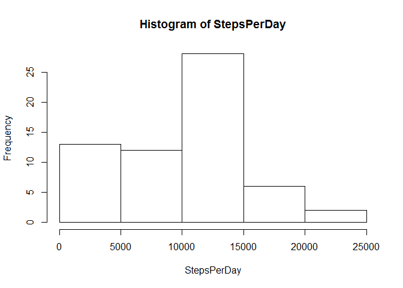
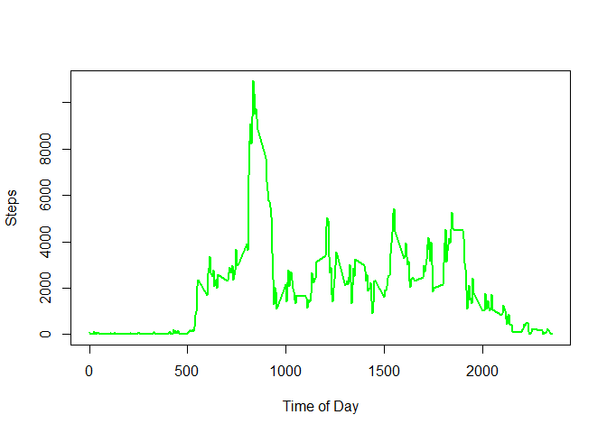
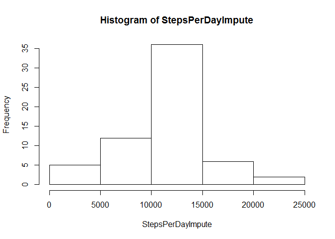
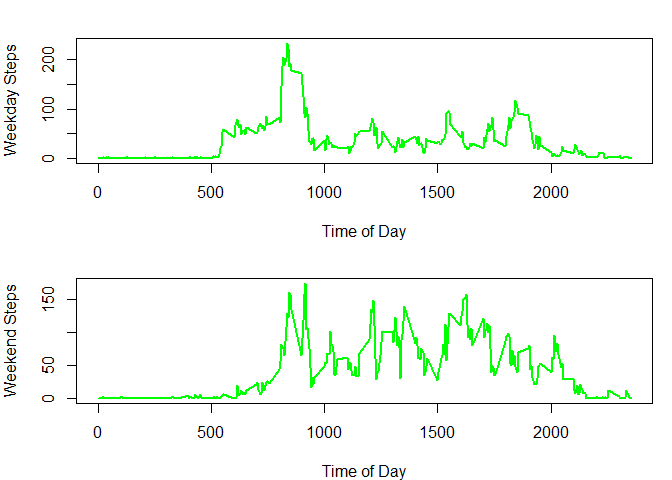

# Reproducible Research Project 1
Jim Staib  
January 27, 2017  


```
## Warning: package 'knitr' was built under R version 3.3.1
```
# Loading and preprocessing the data

```r
activity <- read.csv("activity.csv")
```

#What is mean total number of steps taken per day?


```r
StepsPerDay <- with(activity, tapply(steps,date, sum, na.rm=T))
hist(StepsPerDay)
```

<!-- -->

```r
meanSteps <- as.integer(mean(StepsPerDay))
medianSteps <- as.integer(median(StepsPerDay))
```

Mean Steps Per Day is 9354.   Median Steps Per Day is 10395.

#What is the average daily activity pattern?


```r
StepsPerInterval <- with(activity, tapply(steps,interval, sum, na.rm=T))
plot(names(StepsPerInterval), StepsPerInterval, type="l", xlab= "Time of Day", ylab= "Steps", col="green" , lwd=2)
```

<!-- -->

```r
maxInterval <- names(which.max(StepsPerInterval))
```

The 5 minute interval with the maximum average number of steps across all days is 835.

#Imputing missing values

To impute missing values, this code uses plyr's ddply to transform the activity data frame using a custom "impute.mean" function.   Because the results are out of order, the dataframe is resorted using to match the original sort order


```r
#sum missing number of steps
missingSteps <- sum(is.na(activity$steps)) 
#replace na with mean
library(plyr)
```

```
## Warning: package 'plyr' was built under R version 3.3.1
```

```r
impute.mean <- function(x) replace(x, is.na(x), mean(x, na.rm = TRUE))
actImpute <- ddply(activity, ~ interval, transform, steps = impute.mean(steps))
actImpute <- actImpute[order(actImpute$date,actImpute$interval), ] 
StepsPerDayImpute <- with(actImpute, tapply(steps,date, sum, na.rm=T))
hist(StepsPerDayImpute)
```

<!-- -->

```r
meanStepsImpute <- as.integer(mean(StepsPerDayImpute))
medianStepsImpute <- as.integer(median(StepsPerDayImpute))
```

Mean Steps Per Day using imputed data is 10766.   Median Steps Per Day using Imputed data is 10766.      These values are different from the estimates in the first part of the assignment and result in mean and median being equal.


#Are there differences in activity patterns between weekdays and weekends?


```r
par(mfrow = c(2,1), mar= c(4,4,2,1))
weekdayactivity <- subset(activity,weekdays(as.POSIXct(activity$date),abbreviate=TRUE) != "Sun" & weekdays(as.POSIXct(activity$date),abbreviate=TRUE) != "Sat")
StepsPerIntervalWeekday <- with(weekdayactivity, tapply(steps,interval, mean, na.rm=T))
plot(names(StepsPerIntervalWeekday), StepsPerIntervalWeekday, type="l", xlab= "Time of Day", ylab= "Weekday Steps", col="green" , lwd=2)

weekendactivity <- subset(activity,weekdays(as.POSIXct(activity$date),abbreviate=TRUE) == "Sun" | weekdays(as.POSIXct(activity$date),abbreviate=TRUE) == "Sat")
StepsPerIntervalWeekend <- with(weekendactivity, tapply(steps,interval, mean, na.rm=T))
plot(names(StepsPerIntervalWeekend), StepsPerIntervalWeekend, type="l", xlab= "Time of Day", ylab= "Weekend Steps", col="green" , lwd=2)
```

<!-- -->
